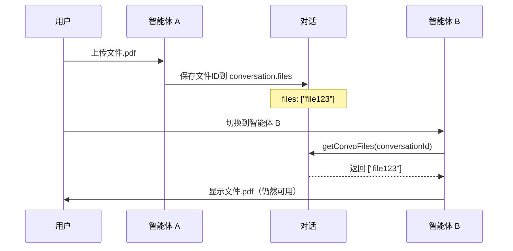

# LibreChat 文件管理完整指南

> 本文档详细说明 LibreChat 中文件上传、存储、检索和跨智能体共享的完整机制
> 
> 更新时间：2026年3月12日 v3
> 
> **最新更新**：新增 Q9 - 解答"为什么旧会话文件在新会话中查不到"的高频问题 🔥

---

## 📚 目录

1. [三种上传方式的区别](#1-三种上传方式的区别)
2. ["作为文本上传"的智能向量化机制](#2-作为文本上传的智能向量化机制)
3. [智能体配置文件的自动使用](#3-智能体配置文件的自动使用)
4. [对话级别的文件持久化机制](#4-对话级别的文件持久化机制)
5. [最佳实践建议](#5-最佳实践建议)
6. [常见问题解答](#6-常见问题解答) ⭐
   - [Q3: 为什么 file_search 查不到文件？](#q3--为什么文件显示在右侧但直接提问时-file_search-工具查不到内容) 🔥 **必读**
   - [Q9: 旧会话的文件为什么新会话查不到？](#q9--旧会话上传并向量化的文件为什么新会话中查不到) 🔥 **高频问题**
7. [技术架构总结](#7-技术架构总结)
8. [附录](#8-附录)

---

## 1. 三种上传方式的区别

> ⚠️ **重要提示**：
> 
> **图片 ≠ 文档文件**，它们的处理机制完全不同！
> 
> - **图片**：直接作为 vision 输入注入到消息中，模型可以"看到"，无需工具
> - **文档**：需要通过工具（file_search）或配置（File Context）才能访问
> 
> ❌ **常见误区 1**："作为文本上传"的文档，如果 `embedded ≠ true`，file_search 工具**查不到**！
> 
> ❌ **常见误区 2**：旧会话上传的文件，在新会话中**不会自动出现**（即使已向量化）！
> 
> ✅ **解决方案**：
> - 使用"上传搜索文件"或配置到智能体的 File Search/File Context
> - 常用文件配置到智能体中，实现跨会话可用
> 
> 📖 详细说明见 [Q3](#q3--为什么文件显示在右侧但直接提问时-file_search-工具查不到内容) 和 [Q9](#q9--旧会话上传并向量化的文件为什么新会话中查不到)

---

在 LibreChat 的聊天界面中，点击附件按钮会看到三种上传选项：

### 1.1 📷 上传图片（Upload Image）

**用途**：将图片作为视觉输入发送给模型

**特点**：
- 图片以图像形式进入上下文，不会自动做整篇 OCR
- 适合截图、界面设计图、手写笔记、照片等需要"看图识图"的场景
- 模型直接分析图像内容

**使用场景**：
```
✅ 分析界面设计
✅ 识别图表内容
✅ 读取截图中的文字
✅ 理解图片含义
```

---

### 1.2 📄 作为文本上传（Upload OCR Text / Context）

**用途**：提取文件文本内容作为对话上下文

**特点**：
- 文件内容提取成**纯文本**后发送给模型
- 支持 PDF、Word、txt、md、代码文件等
- **智能向量化**：大文档（≥5000 tokens）自动向量化
- 文本占用当前消息的上下文长度

**智能处理策略**：
| 文档大小 | 处理方式 | token 阈值 |
|---------|---------|-----------|
| 小文档 | 全文注入 | < 5000 tokens |
| 大文档 | 向量检索 | ≥ 5000 tokens |

**使用场景**：
```
✅ 临时查询某个文档内容
✅ 一次性分析报告
✅ 代码文件审查
✅ 配置文件检查
```

**持久化机制**：
- ✅ 文件会保存到数据库
- ✅ 大文档会自动向量化并建立索引
- ✅ 在**当前对话**中可持续使用
- ⚠️ 新建对话需要重新上传

> ⚠️ **重要警告：file_search 工具可能查不到这些文件！**
> 
> **原因**：只有 `embedded=true`（已向量化）的文件才会被归入 file_search 工具资源。
> 
> **什么情况下 embedded ≠ true？**
> - 小文件（< 5000 tokens）不会被向量化
> - 大文件向量化还在进行中
> - 向量化失败
> 
> **如何确保 file_search 能找到？**
> - ✅ 使用"上传搜索文件"（强制向量化）
> - ✅ 配置到智能体的 File Search（推荐）
> - ✅ 配置到智能体的 File Context（内容自动注入，不需要工具）
> 
> 📖 详细说明见 [Q3](#q3--为什么文件显示在右侧但直接提问时-file_search-工具查不到内容)

---

### 1.3 🔍 上传搜索文件（Upload File Search）

**用途**：上传到 RAG 知识库，作为可检索的向量数据

**特点**：
- 所有文件**强制向量化**处理
- 建立向量索引，支持语义检索
- 专门用于 RAG（检索增强生成）场景
- 可跨多轮对话使用

**处理流程**：
```
文件上传 → 文本提取 → 向量化 → 存入向量数据库 → 可检索
```

**使用场景**：
```
✅ 产品手册
✅ 技术文档
✅ 公司规范
✅ 知识库文档
✅ 需要反复查询的资料
```

---

### 1.4 对比总结

| 特性 | 上传图片 | 作为文本上传 | 上传搜索文件 |
|------|---------|------------|-------------|
| **主要用途** | 图像分析 | 临时文本上下文 | 知识库检索 |
| **向量化** | ❌ 不向量化 | ⚠️ 大文档自动向量化 | ✅ 强制向量化 |
| **持久化** | ✅ 保存到对话 | ✅ 保存到对话 | ✅ 保存到知识库 |
| **跨会话** | ❌ 需重新上传 | ❌ 需重新上传 | ✅ 可跨会话（根据配置） |
| **检索方式** | 无 | 智能混合（全文+向量） | 纯向量检索 |
| **file_search 工具** | ❌ 不支持 | ⚠️ 仅 embedded=true 时支持 | ✅ 完全支持 |
| **适用场景** | 截图、图表 | 临时查询 | 长期知识库 |

---

### 1.5 快速决策指南 🎯

**场景 1：我想让智能体直接看到文件内容（类似看图片）**

```
✅ 推荐：配置到智能体 File Context
   → 智能体配置 → File Context → 上传文件
   → 内容自动注入到每轮对话的上下文中
   → 无需工具调用，智能体直接"看到"内容 ✅
```

---

**场景 2：我想用 file_search 工具检索文件**

```
✅ 推荐：
  选项 A（对话临时）：
    点击附件 → "上传搜索文件" → 选择文件
    → 强制向量化，embedded=true
    → file_search 可以找到 ✅

  选项 B（智能体永久）：
    智能体配置 → File Search → 上传文件
    → 所有对话都可以用 file_search 检索 ✅

❌ 不推荐："作为文本上传"
    → 小文件不向量化，embedded=false
    → file_search 找不到 ❌
```

---

**场景 3：我只是临时查询一下小文件（< 5000 tokens）**

```
✅ 推荐：配置到智能体 File Context
   → 内容自动注入，无需向量化
   → 直接提问即可 ✅

或者：
✅ "作为文本上传" + 在消息中明确提到文件内容
   → 小文件会全文注入到上下文
   → 但不建议依赖 file_search 工具
```

---

**场景 4：我想让文件在多个智能体间共享**

```
✅ 推荐：确保 resendFiles=true（默认）
   → 在任意智能体中上传文件
   → 切换智能体后文件仍然可用
   → 适合协作场景 ✅

详见：[Q4](#q4-为什么切换智能体后之前上传的文件还在)
```

---

## 2. "作为文本上传"的智能向量化机制

### 2.1 核心逻辑

LibreChat 对"作为文本上传"做了智能优化，不是简单的"临时上下文"：

```typescript
// 关键代码：packages/api/src/files/text.ts

// 🔥 只向量化大文档（避免资源浪费）
const RAG_VECTOR_THRESHOLD = parseInt(process.env.RAG_VECTOR_THRESHOLD || '5000', 10);
const actualTokens = await countTokens(responseData.text);

if (actualTokens >= RAG_VECTOR_THRESHOLD) {
  // 大文档：开始向量化
  logger.info(`📝 [文档上传] ${file.originalname} | 策略: 向量检索 | 状态: 开始向量化`);
  vectorizeDocumentAsync(file, file_id, userId, actualTokens, fileSizeKB).catch((err) => {
    logger.error(`❌ [向量化失败] ${file.originalname} - ${err.message}`);
  });
} else {
  // 小文档：全文注入
  logger.info(`📝 [文档上传] ${file.originalname} | 策略: 全文注入`);
}
```

### 2.2 使用时的智能检索

```typescript
// 关键代码：packages/api/src/files/context.ts

// 小文档：全文注入
if (tokenCount < RAG_VECTOR_THRESHOLD) {
  resultText += `# "${file.filename}"\n${file.text}\n`;
}

// 大文档：向量检索
if (largeFiles.length > 0 && userQuery && userId && process.env.RAG_API_URL) {
  const chunks = await vectorSearch(userQuery, file.file_id, userId, ragConfig.topK);
  // 只提取相关片段
  resultText += formatChunks(chunks, file.filename);
}
```

### 2.3 为什么会看到 "Indexing document for intelligent search..."

**现象**：
```
测试井试油小结.pdf
Document 🔄
⏳ Indexing document for intelligent search...
```

**原因**：
- 你上传的 PDF 超过了 5000 tokens
- 系统自动触发了向量化索引
- 这个过程是异步的，通常需要 20-30 秒

**完成后**：
```
测试井试油小结.pdf
Document ✅
✅ Ready for vector search
```

### 2.4 配置参数

可以通过环境变量调整阈值：

```bash
# .env 文件
RAG_VECTOR_THRESHOLD=5000  # 默认 5000 tokens
RAG_API_URL=http://rag-api:8000  # RAG 服务地址
```

---

## 3. 智能体配置文件的自动使用

### 3.1 三种智能体文件类型

在智能体配置面板（Agent Config）中可以上传三种类型的文件：

#### 📝 文件上下文（File Context）

**存储位置**：`tool_resources.context.file_ids`

**自动加载机制**：
```typescript
// 从智能体配置自动加载
const fileIds = tool_resources[EToolResources.context]?.file_ids ?? [];
const context = await getFiles({ file_id: { $in: fileIds } });

// 自动添加到 attachments，内容会自动注入到对话上下文
attachments.push(file);
```

**工作方式**：
- ✅ 新对话启动时自动加载
- ✅ 文件内容通过 `extractFileContext` 自动提取
- ✅ 文本内容作为补充指令注入到每轮对话
- ✅ 完全自动，无需用户操作

**适用场景**：
```
✅ 公司规范、流程文档
✅ 产品说明书
✅ 常用参考资料
✅ 智能体的背景知识
```

---

#### 🔍 文件搜索（File Search）

**存储位置**：`tool_resources.file_search.file_ids`

**自动加载机制**：
```javascript
// 自动从智能体配置加载
const file_ids = tool_resources?.[EToolResources.file_search]?.file_ids ?? [];
const files = await getFiles({ file_id: { $in: file_ids } });

// 自动创建工具上下文
toolContext = `- Note: Use the file_search tool to find relevant information within:
  - 文档1.pdf
  - 手册2.docx`;
```

**工作方式**：
- ✅ 新对话启动时自动加载文件列表
- ✅ 自动创建 `file_search` 工具
- ✅ 模型根据需要自动调用检索
- ✅ 完全自动，无需手动选择

**适用场景**：
```
✅ 技术文档库
✅ FAQ 知识库
✅ 产品手册集
✅ 需要检索的大量资料
```

---

#### 💻 代码文件（Code Files）

**存储位置**：`tool_resources.execute_code.file_ids`

**自动加载机制**：
- 代码解释器启动时自动加载
- 模型执行代码时自动可访问这些文件

**适用场景**：
```
✅ 数据文件（CSV、JSON）
✅ 配置文件
✅ 脚本库
✅ 测试数据
```

---

### 3.2 完全自动，无需手动选择

**重要**：智能体配置中的文件是"设置一次，永久自动生效"的。

**场景示例 1：技术支持智能体**
```
1. 在智能体配置中上传 3 个 PDF 手册到 File Search
2. 开启新对话，选择该智能体
3. 你问："如何重置密码？"
4. 模型自动调用 file_search 工具检索这 3 个 PDF
5. 找到相关内容后回答

✅ 全程无需手动选择文件
```

**场景示例 2：公司规范助手智能体**
```
1. 在智能体配置中上传"员工手册.docx"到 File Context
2. 开启新对话，选择该智能体
3. 员工手册的内容自动提取并作为背景知识注入
4. 模型的回答自动基于手册内容

✅ 无需任何额外操作
```

---

### 3.3 对比：智能体文件 vs 对话中上传文件

| 维度 | 智能体配置中的文件 | 对话中临时上传的文件 |
|------|------------------|------------------|
| **自动加载** | ✅ 开启新对话自动生效 | ❌ 需要每次手动上传 |
| **持久化** | ✅ 永久绑定到智能体 | ⚠️ 仅在当前对话有效 |
| **跨对话** | ✅ 所有使用该智能体的对话都可用 | ❌ 新对话需重新上传 |
| **手动选择** | ❌ 完全自动，无需选择 | ⚠️ 每次需手动上传 |
| **适用场景** | 长期知识库、固定资源 | 临时查询、单次使用 |

---

## 4. 对话级别的文件持久化机制

### 4.1 为什么切换智能体后文件还在？

这是 LibreChat 的**设计特性**，用于支持智能体协作场景。

#### 数据模型

```typescript
// Conversation Schema
{
  conversationId: String,
  title: String,
  agent_id: String,    // 当前智能体 ID
  files: [String],     // 👈 对话级别的文件 ID 数组
  ...
}
```

**关键点**：上传的文件会保存到**对话对象**的 `files` 字段，而不仅仅是智能体配置。

---

### 4.2 resendFiles 参数（默认启用）

```typescript
// 配置：api/server/services/Endpoints/agents/initialize.js
resendFiles: primaryConfig.resendFiles ?? true,  // 默认为 true

// 初始化智能体时的逻辑
if (conversationId != null && resendFiles) {
  // 从对话中加载所有历史文件
  const fileIds = (await db.getConvoFiles(conversationId)) ?? [];
  const toolFiles = (await db.getToolFilesByIds(fileIds, toolResourceSet));
  // 这些文件会在新智能体中继续可用 ✅
}
```

**说明**：
- `resendFiles=true`（默认）：切换智能体时，对话中的文件会继续加载
- `resendFiles=false`：切换智能体时，只加载新智能体配置的文件

---

### 4.3 工作流程示例



---

### 4.4 设计意图：支持智能体协作

代码注释清楚说明了设计意图：

```typescript
/**
 * Load conversation files for ALL agents, not just the initial agent.
 * This enables handoff agents to access files that were uploaded earlier
 * in the conversation. Without this, file_search and execute_code tools
 * on handoff agents would fail to find previously attached files.
 */
```

**使用场景举例**：

**场景：技术方案设计工作流**
```
1. 用户：在「需求分析师」智能体中上传需求文档.pdf
   - 智能体分析需求，生成方案大纲

2. 用户：切换到「架构师」智能体
   - 架构师智能体仍可访问需求文档.pdf ✅
   - 基于需求设计技术架构

3. 用户：切换到「代码生成」智能体
   - 代码生成智能体仍可访问需求文档.pdf ✅
   - 基于需求生成代码框架

4. 用户：切换到「测试专家」智能体
   - 测试专家智能体仍可访问需求文档.pdf ✅
   - 基于需求编写测试用例
```

**优势**：
- ✅ 一次上传，全流程可用
- ✅ 支持多智能体协作
- ✅ 避免重复上传
- ✅ 保持上下文连贯性

---

### 4.5 右侧附件面板显示的内容

右侧"附加文件"面板实际上混合显示了：

| 文件来源 | 说明 | 特征 |
|---------|------|------|
| **智能体配置文件** | 在智能体设置中预配置的文件 | 📌 所有使用该智能体的对话都可见 |
| **对话级别文件** | 在当前对话中上传的文件 | 💬 仅在当前对话中可见，但切换智能体后仍保留 |

**示例**：

假设你有一个"技术支持"智能体，配置了 2 个 PDF 手册：
```
智能体配置文件：
  - 产品手册.pdf
  - 故障排查指南.pdf
```

在对话中又上传了 1 个文件：
```
对话临时上传：
  - 测试井试油小结.pdf  👈 你刚上传的
```

**右侧面板显示**：
```
附加文件：
  ├─ 测试井试油小结.pdf        [对话级别]
  ├─ 产品手册.pdf              [智能体配置]
  └─ 故障排查指南.pdf          [智能体配置]
```

当你切换到另一个智能体（比如"数据分析师"）：
```
附加文件：
  └─ 测试井试油小结.pdf        [对话级别，仍然可见]
```

---

### 4.6 如何关闭跨智能体文件共享？

如果你希望文件在切换智能体后不再可用，可以修改配置：

#### 方法 1：全局配置（librechat.yaml）

```yaml
# librechat.yaml
endpoints:
  agents:
    resendFiles: false  # 禁用跨智能体文件共享
```

#### 方法 2：环境变量

```bash
# .env 文件
AGENTS_RESEND_FILES=false
```

**效果**：
- ✅ 只有智能体配置中的文件会自动加载
- ❌ 对话中临时上传的文件在切换智能体后不再可用
- ✅ 每个智能体只能访问自己的配置文件

---

## 5. 最佳实践建议

### 5.1 文件上传方式选择

| 场景 | 推荐方式 | 原因 |
|------|---------|------|
| 临时查询某个文档 | 作为文本上传 | 系统智能处理，自动决定是否向量化 |
| 长期知识库 | 智能体配置 > File Search | 永久生效，无需重复上传 |
| 小文件/代码片段 | 作为文本上传 | 直接全文注入，无需向量化 |
| 大型手册/规范 | 智能体配置 > File Search | 自动向量检索，高效查询 |
| 截图/界面分析 | 上传图片 | 直接图像分析 |
| 需要跨智能体协作的文档 | 对话中上传（resendFiles=true） | 支持智能体切换 |
| 智能体专属资源 | 智能体配置 | 绑定到特定智能体 |

---

### 5.2 智能体配置建议

**专业智能体示例**：

#### 1️⃣ 法律顾问智能体
```yaml
名称: 法律顾问
描述: 提供法律咨询和合同审查服务

File Context (文件上下文):
  - 公司法律政策.pdf
  - 合同模板库.docx

File Search (知识库):
  - 中华人民共和国民法典.pdf
  - 劳动法全文.pdf
  - 公司法全文.pdf
  - 历史案例库（100+ 文件）
```

#### 2️⃣ 技术支持智能体
```yaml
名称: 技术支持专家
描述: 解决产品技术问题

File Context (文件上下文):
  - 常见问题快速手册.md

File Search (知识库):
  - 产品技术手册.pdf
  - API 文档.pdf
  - 故障排查指南.pdf
  - 版本更新日志.md

Code Files (代码文件):
  - 诊断脚本.py
  - 配置模板.json
```

#### 3️⃣ HR 助手智能体
```yaml
名称: HR 助手
描述: 提供人事政策咨询和流程指导

File Context (文件上下文):
  - 员工手册.pdf
  - 请假流程.docx

File Search (知识库):
  - 薪酬福利政策.pdf
  - 绩效考核制度.pdf
  - 培训资料库（50+ 文件）
```

---

### 5.3 resendFiles 配置建议

#### 场景 1：支持智能体协作
```yaml
# librechat.yaml
endpoints:
  agents:
    resendFiles: true  # 推荐：默认值
```

**适用情况**：
- ✅ 需要多个智能体协作处理同一份文档
- ✅ 工作流涉及多个专业角色
- ✅ 希望避免重复上传

---

#### 场景 2：严格隔离智能体
```yaml
# librechat.yaml
endpoints:
  agents:
    resendFiles: false  # 严格模式
```

**适用情况**：
- ✅ 每个智能体处理独立任务
- ✅ 注重数据隔离和安全
- ✅ 避免文件混淆

---

### 5.4 向量化阈值调整

根据你的服务器性能和文档特点，可以调整阈值：

```bash
# .env 文件

# 保守策略（更多向量化）
RAG_VECTOR_THRESHOLD=3000

# 默认策略
RAG_VECTOR_THRESHOLD=5000

# 激进策略（减少向量化，节省资源）
RAG_VECTOR_THRESHOLD=10000
```

**建议**：
- 服务器性能强 → 设置较小值（3000-5000）
- 服务器性能弱 → 设置较大值（7000-10000）
- 主要处理短文档 → 设置较大值
- 主要处理长文档 → 设置较小值

---

### 5.5 文件管理工作流

#### 推荐工作流
```
1. 创建智能体
   ↓
2. 上传长期使用的文件到智能体配置
   - File Context: 背景知识、规范
   - File Search: 知识库、手册
   - Code Files: 数据文件、脚本
   ↓
3. 开启对话，选择智能体
   ↓
4. 临时上传文件（如需要）
   - 使用"作为文本上传"
   - 系统自动判断是否向量化
   ↓
5. 如需切换智能体协作
   - resendFiles=true: 文件自动跟随
   - resendFiles=false: 需重新上传
```

---

## 6. 常见问题解答

### Q1: 为什么我选择"作为文本上传"，文件还是被向量化了？

**A**: 这是正常的智能行为。LibreChat 会自动检测文档大小：
- 小文档（< 5000 tokens）：直接全文注入，不向量化
- 大文档（≥ 5000 tokens）：自动向量化，提高检索效率

这样设计既保证了小文档的快速响应，又优化了大文档的检索性能。

---

### Q2: 智能体配置的文件需要每次手动选择吗？

**A**: 不需要！智能体配置中的文件会**完全自动生效**：
- File Context: 内容自动注入到对话上下文
- File Search: 模型自动判断是否需要检索
- Code Files: 代码执行时自动可访问

你只需要在智能体配置时上传一次，后续所有对话都会自动使用。

---

### Q3: 🔥 为什么文件显示在右侧，但直接提问时 file_search 工具查不到内容？

**A**: 这是 LibreChat 最容易混淆的地方！**核心原因：图片和文档的处理机制完全不同**。

#### 为什么图片可以直接查询？

```
用户上传图片 → 图片作为 vision 输入直接注入到消息 content
             → 模型可以"看到"图片 → 直接回答问题 ✅
```

**关键**: 图片不需要工具，直接在消息内容中。

---

#### 为什么文档不能直接查询？

```
用户"作为文本上传"文档 → 文档保存到数据库
                      ↓
                文档是否向量化？
                      ↓
     ┌────────────────┴────────────────┐
     ↓                                 ↓
 embedded=true                    embedded=false
（已向量化）                        （未向量化）
     ↓                                 ↓
归入 file_search 工具              不归入任何工具 ❌
     ↓                                 ↓
模型调用 file_search              file_search 查不到 ❌
     ↓
查询成功 ✅
```

**核心机制（代码层面）**：

```typescript
// packages/api/src/agents/resources.ts

// 文件分类逻辑
const categorizeFileForToolResources = ({ file, tool_resources, ... }) => {
  // 只有 embedded=true 的文件才会被归入 file_search
  if (file.embedded === true) {
    addFileToResource({
      file,
      resourceType: EToolResources.file_search,  // 👈 只有这样才能被 file_search 工具找到
      tool_resources,
      processedResourceFiles,
    });
    return;
  }
  
  // 如果 embedded 不是 true，文件不会被添加到任何工具资源
  // file_search 工具就查不到这个文件 ❌
};
```

---

#### 什么情况下 embedded 不是 true？

| 情况 | embedded 状态 | file_search 能否找到 |
|------|-------------|-------------------|
| 文件 < 5000 tokens | false（不向量化） | ❌ 查不到 |
| 文件 ≥ 5000 tokens，向量化中 | false（处理中） | ❌ 暂时查不到 |
| 文件 ≥ 5000 tokens，向量化完成 | **true** | ✅ 可以查到 |
| 文件向量化失败 | false | ❌ 查不到 |
| 通过"上传搜索文件"上传 | **true**（强制向量化） | ✅ 可以查到 |

---

#### 解决方案

**方案 1：等待向量化完成（仅限大文件）**

```
1. 上传 ≥ 5000 tokens 的文件
2. 等待状态从 "🔄 Indexing..." 变为 "✅ Ready for vector search"
3. 此时 embedded=true，file_search 可以找到
```

**方案 2：使用"上传搜索文件"（推荐）**

```
1. 点击附件 → 选择"上传搜索文件"
2. 文件强制向量化，embedded 自动设为 true
3. file_search 工具可以立即找到（向量化完成后）
```

**方案 3：配置到智能体 File Context（小文件推荐）**

```
1. 在智能体配置中 → File Context → 上传文件
2. 文件内容会自动注入到上下文
3. 不需要 file_search 工具，模型直接能"看到"内容 ✅
```

**方案 4：配置到智能体 File Search（知识库推荐）**

```
1. 在智能体配置中 → File Search → 上传文件
2. 文件会被向量化并设置 embedded=true
3. file_search 工具自动可用，所有对话都能查询 ✅
```

---

#### 对比：图片 vs 文档文件

| 维度 | 图片 | 文档文件 |
|------|------|---------|
| **注入方式** | 直接在消息 content | 需要通过工具或配置 |
| **模型访问** | 直接"看到" | 需要调用工具或提前注入 |
| **是否需要工具** | ❌ 不需要 | ✅ 需要（file_search 或 context） |
| **向量化要求** | ❌ 不需要 | ⚠️ file_search 需要 embedded=true |
| **直接提问** | ✅ 可以 | ❌ 不可以（除非配置到 File Context） |

---

#### 实际案例分析

**你的情况（从截图分析）**：

```
1. 你上传了"比对详情.pdf"等文件（通过"作为文本上传"）
2. 这些文件可能 < 5000 tokens，或者还在向量化中
3. 因此 embedded ≠ true
4. file_search 工具无法找到这些文件
5. 你直接提问"中油海222和万利合18有啥不同"
6. 模型调用 file_search 工具，但返回结果为空 ❌
```

**正确做法**：

```
选项 A（推荐）：
  点击附件 → "上传搜索文件" → 选择 PDF
  → 等待向量化完成 → 直接提问 ✅

选项 B（智能体配置）：
  智能体配置 → File Search → 上传 PDF
  → 开启对话 → 直接提问 ✅

选项 C（小文件）：
  智能体配置 → File Context → 上传 PDF
  → 内容自动注入上下文 → 直接提问 ✅
```

---

### Q4: 为什么切换智能体后，之前上传的文件还在？

**A**: 这是为了支持智能体协作场景的设计特性：
- 文件保存在对话级别（`conversation.files`）
- 默认 `resendFiles=true`，切换智能体时文件会继续可用
- 如果不需要这个功能，可以设置 `resendFiles=false`

---

### Q5: 右侧附件面板显示的文件是哪些？

**A**: 混合显示两种来源：
1. **智能体配置文件**：在智能体设置中预配置的文件
2. **对话级别文件**：在当前对话中上传的文件

目前界面无法区分来源，但它们都是**已经生效**的文件，不是"可选"的。

---

### Q6: 如何区分"临时查询"和"长期知识库"？

**A**: 
- **临时查询**：在对话中"作为文本上传"，仅当前对话有效
- **长期知识库**：在智能体配置中上传到 File Search，永久生效

建议：反复使用的文档配置到智能体中，一次性查询的文档在对话中上传。

---

### Q7: 向量化失败怎么办？

**A**: 检查以下几点：
1. 确认 RAG API 服务是否正常运行
2. 检查 `.env` 中 `RAG_API_URL` 配置是否正确
3. 查看服务器日志中的错误信息
4. 文件格式是否支持（PDF、Word、txt 等）
5. 文件大小是否超过限制

---

### Q8: 如何清理对话中的临时文件？

**A**: 有几种方式：
1. 开启新对话：临时文件不会跟随到新对话
2. 右侧附件面板删除文件
3. 设置 `resendFiles=false`，切换智能体时自动清理

---

### Q9: 🔥 旧会话上传并向量化的文件，为什么新会话中查不到？

**A**: **✅ 这是完全正常的预期行为！**

#### 核心原因

```
旧会话（conversationId: abc123）
  ├─ conversation.files: ["file_xyz"]  ← 文件ID保存在旧会话
  └─ 文件已向量化：embedded=true ✅

新会话（conversationId: def456）  ← 完全不同的会话ID
  ├─ conversation.files: []  ← 空的，没有任何文件
  └─ file_search 工具查询 conversation.files
                    → 找不到文件 ✅ 正常！
```

**关键点**：
- 每个会话都有独立的 `conversationId`
- 文件通过 `conversation.files` 字段关联到会话
- 新会话 = 新的 conversationId = 空的 files 数组
- **即使文件已向量化（embedded=true），也不会自动出现在新会话中**

---

#### 为什么不自动跨会话？

这是有意的设计决策：

**设计理念**：
```
✅ 会话隔离：每个会话独立，避免文件混淆
✅ 上下文清晰：新会话从空白状态开始
✅ 隐私保护：不同会话的文件互不干扰
```

**`resendFiles` 参数的作用范围**：
- ✅ 同一会话内切换智能体：文件会跟随
- ❌ 新建会话：文件不会跟随

---

#### 解决方案对比

| 方案 | 操作频率 | 跨会话 | 推荐度 | 适用场景 |
|------|---------|-------|--------|---------|
| **配置到智能体 File Search** | 一次配置 | ✅ 所有会话 | ⭐⭐⭐⭐⭐ | 常用文件、知识库 |
| **配置到智能体 File Context** | 一次配置 | ✅ 所有会话 | ⭐⭐⭐⭐ | 小文件、规范文档 |
| **每次新会话重新上传** | 每次会话 | ❌ 仅当前会话 | ⭐⭐⭐ | 临时文件、一次性查询 |

---

#### 推荐做法 ⭐

**场景 1：这个文件会经常用到**

```
✅ 配置到智能体 File Search（推荐）

操作步骤：
1. 打开智能体配置页面
2. 滚动到"文件搜索"区域
3. 勾选 ☑️ "启用文件搜索"
4. 点击"上传搜索文件"
5. 上传你的 PDF/文档
6. 保存智能体配置

效果：
  → 所有新会话自动可用 ✅
  → 不需要重复上传 ✅
  → file_search 自动工作 ✅
  → 向量化状态持久保存 ✅
```

---

**场景 2：小文件（规范、手册）**

```
✅ 配置到智能体 File Context

操作步骤：
1. 智能体配置 → "文件上下文"
2. 点击"上传文件上下文"
3. 上传文件
4. 保存

效果：
  → 内容自动注入到每轮对话 ✅
  → 智能体直接"看到"内容 ✅
  → 不需要 file_search 工具 ✅
```

---

**场景 3：临时使用一次**

```
✅ 每次新会话重新上传

操作步骤：
1. 点击附件按钮
2. 选择"上传搜索文件"（不是"作为文本上传"！）
3. 选择文件
4. 等待向量化完成（"✅ Ready"）
5. 直接提问

注意事项：
  ⚠️ 必须用"上传搜索文件"
  ⚠️ 不要用"作为文本上传"（小文件不向量化）
  ⚠️ 之前的向量化数据会保留，但不会自动关联到新会话
```

---

#### 常见误区

**❌ 误区 1**："文件已经向量化了，应该所有会话都能用"
```
✘ 错误理解：向量化 = 全局可用
✓ 正确理解：向量化 ≠ 自动关联到所有会话
             需要通过智能体配置或重新上传来建立关联
```

**❌ 误区 2**："resendFiles=true 应该让文件跨会话"
```
✘ 错误理解：resendFiles 让文件出现在所有新会话
✓ 正确理解：resendFiles 只在同一会话内切换智能体时生效
             新会话 = 新 conversationId = 不继承文件
```

**❌ 误区 3**："右侧显示的文件就是可搜索的"
```
✘ 错误理解：右侧有文件 = file_search 能找到
✓ 正确理解：还要看 embedded=true 和文件类型
             详见 Q3
```

---

#### 技术细节

**数据库层面**：

```typescript
// 旧会话
Conversation {
  conversationId: "conv_old_123",
  files: ["file_xyz"],  // 文件关联在这里
  ...
}

// 新会话
Conversation {
  conversationId: "conv_new_456",  // 完全不同的 ID
  files: [],  // 空数组，不会自动继承旧会话的文件
  ...
}

// 文件记录
File {
  file_id: "file_xyz",
  embedded: true,  // 向量化完成
  text: "...",
  // 但没有字段记录"应该在哪些会话中可用"
  // 完全依赖 conversation.files 的关联
}
```

**查询逻辑**：

```typescript
// file_search 工具的文件加载逻辑
const fileIds = await db.getConvoFiles(conversationId);  // 只查询当前会话
const files = await db.getFiles({ file_id: { $in: fileIds } });

// 如果当前会话的 files=[]，就查不到任何文件
// 即使其他会话中有相同文件
```

---

#### 最佳实践总结

**规则 1：常用文件配置到智能体**
```
✅ 技术文档、产品手册、公司规范
✅ 需要反复查询的知识库
✅ 多个会话都需要的参考资料
```

**规则 2：临时文件每次上传**
```
✅ 一次性分析的报告
✅ 临时查询的文档
✅ 不同会话用不同的文件
```

**规则 3：理解会话隔离机制**
```
✅ 新会话 = 新起点，不继承旧会话文件
✅ 通过智能体配置实现文件"全局化"
✅ resendFiles 只影响同一会话内的智能体切换
```

---

## 7. 技术架构总结

### 7.1 文件存储层次

```
┌─────────────────────────────────────┐
│     全局文件数据库（Files）          │
│  所有文件的元数据和内容              │
└─────────────────────────────────────┘
              ▲
              │ file_id 引用
              │
    ┌─────────┴─────────┬─────────────┐
    │                   │             │
┌───▼──────┐   ┌────────▼─────┐  ┌───▼───────┐
│ 智能体配置│   │  对话对象     │  │ 消息对象   │
│tool_reso-│   │conversation. │  │message.   │
│urces     │   │files[]       │  │files[]    │
└──────────┘   └──────────────┘  └───────────┘
   持久化          会话级别          消息级别
```

### 7.2 文件加载优先级

```
1. 智能体配置文件（tool_resources）
   ↓ 自动加载
2. 对话历史文件（conversation.files）
   ↓ resendFiles=true 时加载
3. 当前请求文件（request attachments）
   ↓ 当次请求使用
```

### 7.3 向量化决策树

```
文件上传
    │
    ├─ 工具类型判断
    │   ├─ file_search → 强制向量化
    │   └─ context     → 智能判断
    │
    ├─ Token 计数
    │   ├─ < 5000 tokens → 全文注入
    │   └─ ≥ 5000 tokens → 向量化
    │
    └─ RAG API 可用性
        ├─ 可用 → 向量化
        └─ 不可用 → 全文截断
```

---

## 8. 附录

### 8.1 相关配置文件

#### librechat.yaml 配置示例
```yaml
version: 1.1.5

endpoints:
  agents:
    # 是否在切换智能体时重新加载对话中的文件
    resendFiles: true  # 默认 true
    
    # 智能体能力配置
    capabilities:
      - context         # 文件上下文
      - file_search     # 文件搜索
      - execute_code    # 代码执行
```

#### .env 配置示例
```bash
# RAG 服务配置
RAG_API_URL=http://localhost:8000
RAG_VECTOR_THRESHOLD=5000  # 向量化阈值（tokens）

# 智能体配置
AGENTS_RESEND_FILES=true   # 是否跨智能体共享文件
```

---

### 8.2 相关 API 端点

```
文件上传:
POST /api/files/upload

文件删除:
DELETE /api/files

获取对话文件:
GET /api/conversations/:id/files

智能体配置:
POST /api/agents
PUT /api/agents/:id
```

---

### 8.3 数据库 Schema

```typescript
// Conversation Schema
{
  conversationId: String,
  title: String,
  user: String,
  agent_id: String,
  files: [String],        // 对话级别文件
  messages: [ObjectId],
  ...
}

// Agent Schema
{
  id: String,
  name: String,
  tool_resources: {
    context: {
      file_ids: [String]   // 上下文文件
    },
    file_search: {
      file_ids: [String]   // 知识库文件
    },
    execute_code: {
      file_ids: [String]   // 代码文件
    }
  },
  ...
}

// File Schema
{
  file_id: String,
  filename: String,
  user: String,
  embedded: Boolean,      // 是否已向量化
  text: String,          // 提取的文本
  ...
}
```

---

## 9. 更新日志

### 2026-03-12 v3 🔥 高频问题补充

**新增内容**：
- ✅ 添加 **Q9: 旧会话上传并向量化的文件，为什么新会话中查不到？** - 解答高频困惑
- ✅ 详细解释会话隔离机制（conversationId 与文件关联）
- ✅ 说明为什么向量化≠跨会话可用
- ✅ 澄清 `resendFiles` 参数的作用范围（同一会话切换智能体 vs 新建会话）
- ✅ 提供 3 种解决方案对比（智能体配置 vs 重新上传）
- ✅ 添加常见误区纠正

**核心要点**：
- 📝 新会话 = 新 conversationId = 空的 files 数组
- 📝 文件不会自动跨会话，需要通过智能体配置实现"全局化"
- 📝 resendFiles 只影响同一会话内切换智能体，不影响新会话

**目标读者**：
- 困惑为什么新会话找不到旧会话文件的用户 ⭐⭐⭐
- 想理解会话隔离机制的用户
- 需要配置常用文件的用户

---

### 2026-03-12 v2 🔥 重要更新

**新增内容**：
- ✅ 添加 **Q3: 为什么 file_search 查不到文件？** - 解决最常见困惑
- ✅ 详细解释 `embedded=true` 机制与 file_search 工具的关系
- ✅ 添加"图片 vs 文档文件"的处理机制对比
- ✅ 新增"快速决策指南"（第 1.5 节）- 帮助用户快速选择合适的上传方式
- ✅ 在关键位置添加警告提示框，防止用户踩坑
- ✅ 添加实际案例分析和 4 种解决方案

**技术细节**：
- 📝 揭示文件分类逻辑（`categorizeFileForToolResources`）
- 📝 解释为什么小文件（< 5000 tokens）默认不能被 file_search 找到
- 📝 说明向量化状态对工具可用性的影响

**目标读者**：
- 遇到"上传了文件但查不到"问题的用户 ⭐
- 想理解图片和文档处理差异的用户
- 需要配置智能体文件访问权限的管理员

---

### 2026-03-12 v1
- 初始版本创建
- 涵盖三种上传方式的完整说明
- 添加智能向量化机制解析
- 说明智能体文件自动加载
- 解释对话级别文件持久化
- 提供最佳实践建议

---

## 10. 参考资源

### 相关文档
- [LibreChat RAG 原理与向量化策略分析](./LibreChat_RAG原理与向量化策略分析.md)
- [智能体与 MCP 配置完整指南](./智能体与MCP配置完整指南.md)
- [RAG 优化更新说明](./RAG优化更新说明.md)

### 代码位置
- 文件上传逻辑: `packages/api/src/files/text.ts`
- 文件上下文提取: `packages/api/src/files/context.ts`
- 智能体初始化: `packages/api/src/agents/initialize.ts`
- 对话文件管理: `api/models/Conversation.js`
- **文件分类逻辑**: `packages/api/src/agents/resources.ts` (line 79-117) 🔥
  - `categorizeFileForToolResources()` - 决定文件是否归入 file_search
  - 关键判断：`if (file.embedded === true)` - 只有向量化的文件才能被 file_search 找到
- **file_search 工具**: `api/app/clients/tools/util/fileSearch.js`
  - `primeFiles()` - 加载可搜索的文件（line 22-60）
  - `createFileSearchTool()` - 创建检索工具（line 77+）

---

**文档维护**: 如有问题或建议，请更新本文档并注明日期和变更内容。
