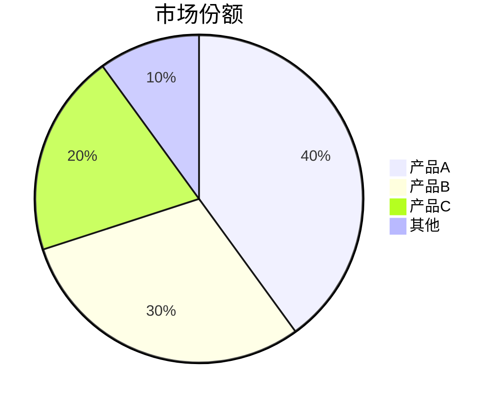
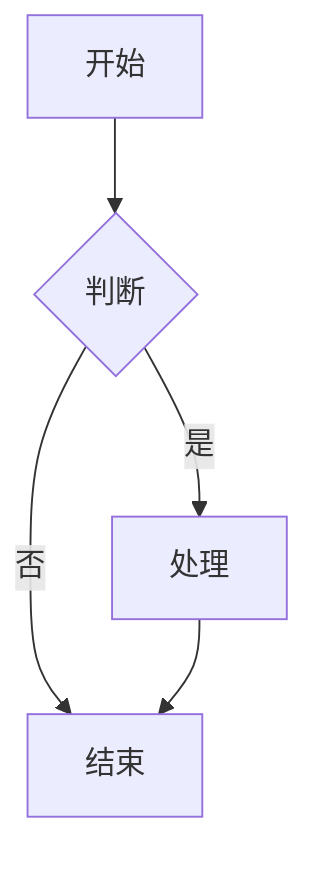
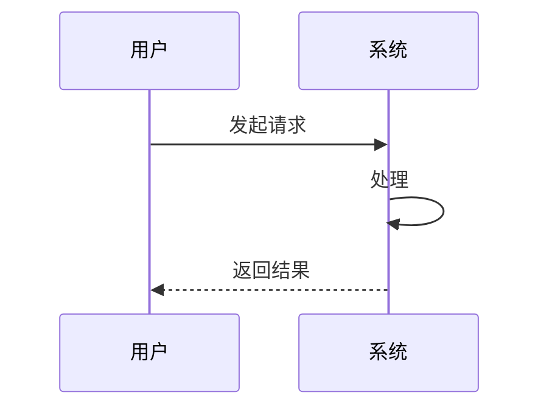
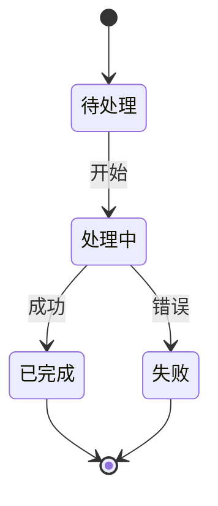

# LibreChat 图表绘制使用说明

## 图表绘制模式说明

LibreChat 支持两种图表绘制方式，根据 Artifacts 开关自动切换：

### 1. 不勾选 Artifacts → 使用 Mermaid（静态图表）
适用场景：快速查看、文档嵌入、静态展示、简单图表

**特点**：
- ✅ 渲染速度快
- ✅ 支持导出为图片
- ✅ 适合流程图、时序图、状态图
- ⚠️ 数据图表功能相对简单（xychart-beta）

**直接提问即可**：
```
画一个柱状图，显示以下数据：一月销售额4000，二月3000，三月5000
```

模型会自动使用 Mermaid 语法。

**如果模型生成 HTML，请明确指定**：
```
用mermaid语法画一个柱状图，显示以下数据：一月销售额4000，二月3000，三月5000
```

### 2. 勾选 Artifacts → 使用 React + recharts（交互式图表）
适用场景：需要交互、动态数据、复杂图表、可编辑

**特点**：
- ✅ 完全交互式（hover、zoom、点击）
- ✅ 支持复杂数据可视化
- ✅ 可以直接编辑代码调整样式
- ✅ 更丰富的图表类型

**直接提问即可**：
```
画一个柱状图，显示以下数据：一月销售额4000，二月3000，三月5000
```

模型会自动使用 React + recharts 生成交互式图表。

## Mermaid 支持的图表类型

### 数据图表（xychart-beta）
支持柱状图、折线图，适合简单数据展示。

**⚠️ 注意**：Mermaid 的 xychart-beta 是实验性功能，部分旧版本可能不支持。如果渲染失败，建议：
1. 勾选 Artifacts 使用 recharts
2. 或使用饼图替代：`用mermaid pie画饼图`

### 流程图与关系图
这些图表类型 Mermaid 支持非常好，推荐使用：
- 流程图：`flowchart` 或 `graph`
- 时序图：`sequenceDiagram`
- 状态图：`stateDiagram-v2`
- 类图：`classDiagram`
- ER图：`erDiagram`
- 甘特图：`gantt`
- 饼图：`pie`

## Mermaid 示例

### 饼图（最稳定，强烈推荐）


### 流程图


### 时序图


### 状态图


### 柱状图（实验性，可能不支持）
```mermaid
xychart-beta
    title "月度销售额"
    x-axis [一月, 二月, 三月]
    y-axis "销售额(元)" 0 --> 6000
    bar [4000, 3000, 5000]
```

**如果 xychart-beta 不工作，请勾选 Artifacts 使用 recharts**

## 提问技巧

### 方法1：让模型自动选择（推荐）
```
画一个柱状图/流程图/时序图，显示...
```

模型会根据 Artifacts 开关自动选择合适的方式。

### 方法2：明确指定 Mermaid
```
用mermaid语法画一个流程图，显示...
```

### 方法3：明确指定图表类型
```
用mermaid pie画一个饼图，显示...
用mermaid flowchart画一个流程图，显示...
用mermaid sequenceDiagram画一个时序图，显示...
```

## 常见问题

**Q: 什么时候用 Mermaid，什么时候用 recharts？**  
A: 
- 流程图、时序图、状态图 → 始终用 Mermaid（Artifacts 开关无影响）
- 数据图表（柱状图、折线图、饼图）→ 根据需求选择：
  - 简单展示 → 不勾选 Artifacts，用 Mermaid
  - 需要交互 → 勾选 Artifacts，用 recharts

**Q: 模型生成了 HTML 怎么办？**  
A: 在提问中明确加上"用mermaid语法"或"用mermaid pie/flowchart"

**Q: Mermaid xychart-beta 报错怎么办？**  
A: 
1. 优先使用饼图：`用mermaid pie画饼图`
2. 或勾选 Artifacts 使用 recharts
3. xychart-beta 是实验性功能，不是所有环境都支持

**Q: 如何导出 Mermaid 图表？**  
A: 点击图表右上角的"复制代码"，然后在支持 Mermaid 的编辑器（如 Typora、Obsidian、VS Code）中粘贴使用

## 配置说明

当前配置：
- ✅ Artifacts 未启用 → 自动使用 Mermaid
- ✅ Artifacts 已启用 → 自动使用 React + recharts  
- ✅ 中文输入自动中文回答
- ❌ chart-inline 已移除（不再支持）
